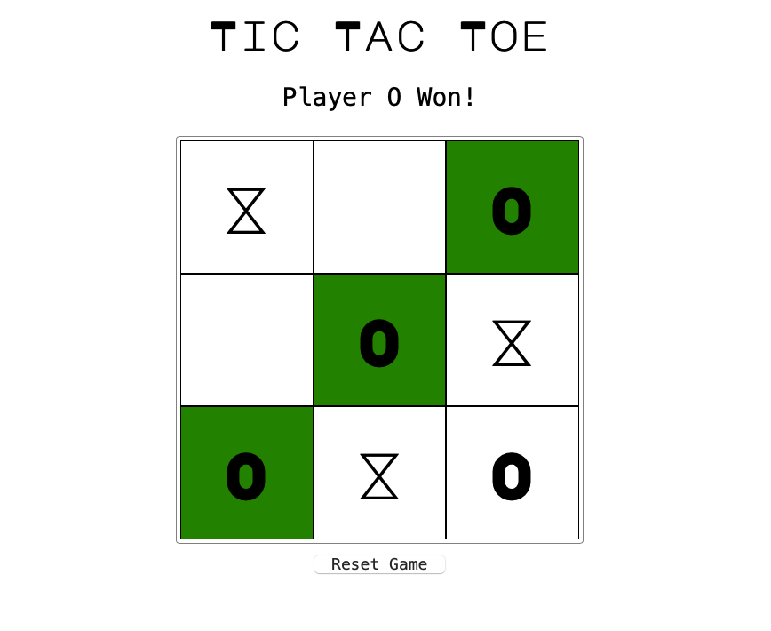

# TIC-TAC-TOE



A simple game of Tic-tac-toe with optional computer opponent.

The AI may be near-impossible to beat at this time. Varying 
levels will be implemented at a later time.

A live build can be found 
[here](https://aaronishibashi.com/portfolio/web/ga/tic-tac-toe).

### Tools Used


- Object-oriented MVC structure to organize front-end state, view, and logic.
- [js-cookie](https://github.com/js-cookie/js-cookie) to store user options.

### Getting Started

With npm:
```shell
npm install
npm run build
```

With yarn:
```shell
yarn install
yarn build
```

`main.js` should then be compiled to the `dist/` folder.

Alternatively, running `npm run dev` or `yarn dev` will 
compile the source and run webpack live server in one go.


### Future Development
- [x] Option to play against computer player 2
- [ ] Add computer level difficulty. It's too difficult.
